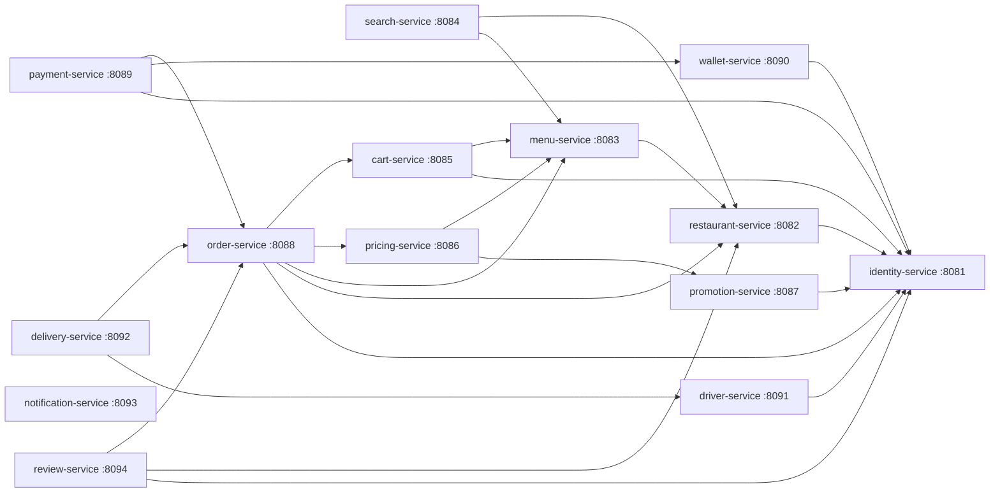
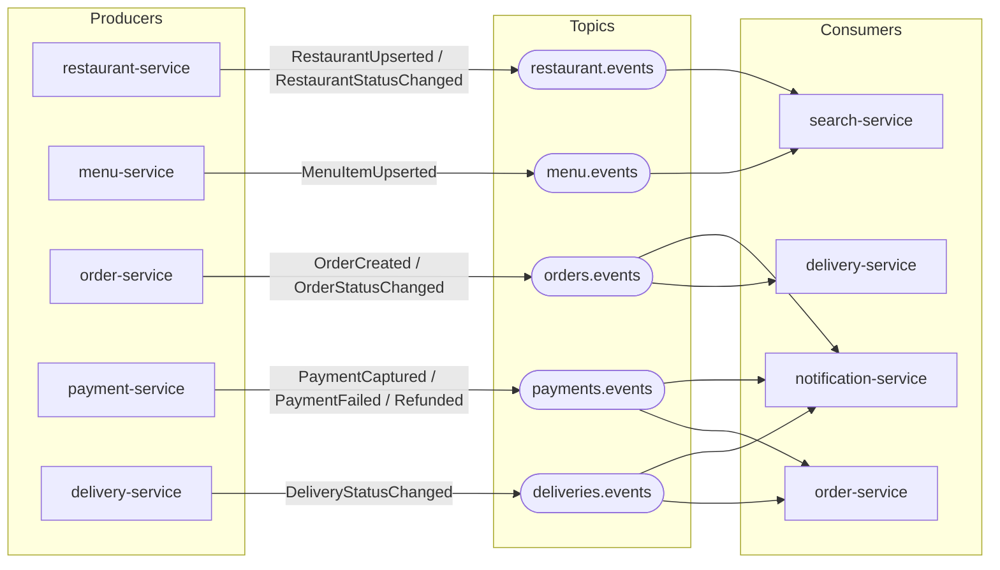
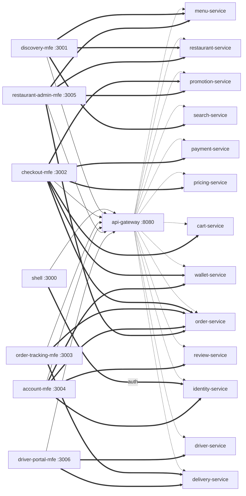

# QuickBite — Dependency Graphs

Mermaid diagrams derived directly from [`PLATFORM_SPEC.md`](../PLATFORM_SPEC.md). Edges are kept
faithful to the spec: §1.1 for sync dependencies, §5 for events, §1.2 for MFE→service calls.

---

## (a) Service-to-service synchronous dependencies (spec §1.1)

Arrows point from caller to callee (`A --> B` means "A makes Feign `/internal` calls to B").

> `notification-service` has no synchronous Feign edges in the steady state — it learns about
> order/delivery/payment activity from events (see diagram b). `identity-service` is the
> foundational leaf; `order-service` and `delivery-service` are the high-fan-in hubs.

---

## (b) Kafka event flows (spec §5)

---

## (c) MFE → service calls (through the gateway, spec §1.2)

Every MFE calls services through `api-gateway` (`VITE_GATEWAY_URL`, default `http://localhost:8080`).

> Solid bold edges (`==>`) show the logical "talks to" target per spec §1.2; all traffic physically
> flows MFE → `api-gateway` (`-->`) → service (`-.->`).
